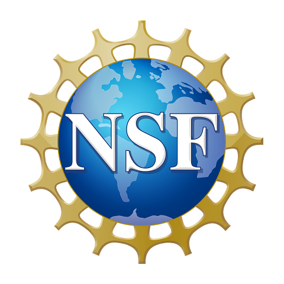

# Data Management

*Data has a lifecycle. Data management is a lifestyle.*

[Image Credit: Harvard Biomedical Data Management](https://datamanagement.hms.harvard.edu)

# Data Transfer

# Data Storage and Filesystems

# About COMPLECS

COMPLECS (COMPrehensive Learning for end-users to Effectively utilize
CyberinfraStructure) is a new SDSC program where training will cover
non-programming skills needed to effectively use
supercomputers. Topics include parallel computing concepts, Linux
tools and bash scripting, security, batch computing, how to get help,
data management and interactive computing. COMPLECS is supported by
NSF award 2320934.

# Acknowledgements

# References:
- https://www.digitalocean.com/community/tutorials/how-to-use-wget-to-download-files-and-interact-with-rest-apis
- https://linuxize.com/post/wget-command-examples/
- https://www.digitalocean.com/community/tutorials/workflow-downloading-files-curl
- https://linuxize.com/post/curl-command-examples/
- https://linuxize.com/post/how-to-use-scp-command-to-securely-transfer-files/
- https://www.digitalocean.com/community/tutorials/how-to-use-sftp-to-securely-transfer-files-with-a-remote-server
- https://www.digitalocean.com/community/tutorials/how-to-use-rsync-to-sync-local-and-remote-directories
- https://www.hpc-carpentry.org
- https://swcarpentry.github.io/shell-novice/
- https://carpentries-incubator.github.io/hpc-intro/
- https://docs.globus.org/guides/
- https://docs.globus.org/guides/tutorials/manage-files/transfer-files/
