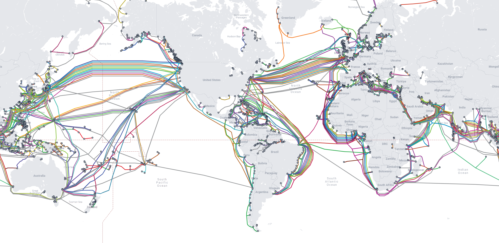

# CIFAR through the tubes: Downloading data from the internet

[Image Credit: Submarine Cable Map](https://www.submarinecablemap.com/)

The aim of this tutorial is to introduce you to command-line tools that are useful for downloading data from the internet to your personal computer or an HPC system, and verifing the data is correct. The dataset we'll be working with is the [CIFAR-10 dataset](https://www.cs.toronto.edu/~kriz/cifar.html), a machine learning dataset that consists of 60K 32x32 colour images broken out into 10 classes, with 6000 images per class.
